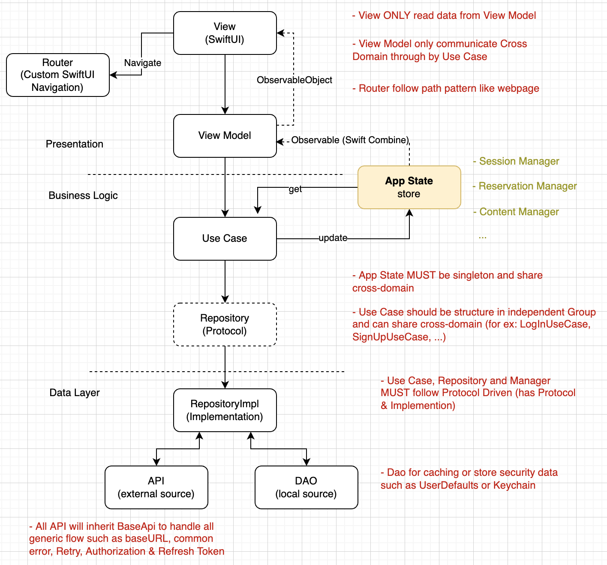

# boilerplate-mvvm-swiftui

Boilerplate iOS Project with MVVM & SwiftUI

## Getting Started

This project is a iOS app of Boilerplate that building by Swift.

## Awareness
- Always think about the million users are using this app, so it must be the **World Class** app
- Coding is not just feature done, it's the **reflection of success**
- To get the best quality, must have the **best solution**
- Always think about & follow up **SOLID principal** for every solutions
- Naming is **VERY VERY IMPORTANT**, it's not coding, it's solution

## Architecture

Apply Clean Architecture + MVVM
```
|-----------------  Layers  ------------------|
| Presentations | Business Logic | Data Layer |
|:-------------------------------------------:|

|--------------------------  Actual  ---------------------------|
| Presentations  |      Business Logic    |         Data        |
|:-------------------------------------------------------------:|
| View <--> ViewModel <--> UseCase <--> Repository <--> API/Dao |
|:-------------------------------------------------------------:|
|:----  Extension Entity   ----|----    Basic Entity   --------:|
|:-------------------------------------------------------------:|
```


### View
- This is the major view layer of iOS app and is categorized by module (feature or epic). 
- View is built by SwiftUI
- View is rendered based on the data from ViewModel
- View that are used across module will be placed in *CommonUI folder* and **MUST NOT** build based on ViewModel.

Examples of a standard view that build based on view-model:
```swift
    @EnvironmentObject var viewModel: ContactViewModel
    
    var body: some View {
        let contact = viewModel.contact

        HStack(alignment: .center) {
            AvatarView(avatar: contact.avatar, size: 32)
            VStack(alignment: .leading) {
                Text(contact.fullName())
                    .primaryBold(fontSize: 15)
                Text("age: \(contact.age())")
                    .secondaryRegular(color: .gray)
            }
            .foregroundColor(.black)
            Spacer()
        }
        .frame(minHeight: 44, maxHeight: 44, alignment: .center)
    }
```

### ViewModel
- It aims to handle business logic for a specific view such as validation, retrieve data, ...
- ViewModel uses use-case to retrieve data or handle domain business logic
- ViewModel observes AppState data to get application state 

and provide ViewModel into View in Route:
```swift
    let contactList = NavigationRoute(path: "/contactList") {
        ContactListView()
            .provideViewModel(create: {
                ContactListViewModel(loadListUseCase: UseCases.loadContactListUseCase())
            })
    }
```

### UseCase
- It's the main layer to handle all data business
- It's a stateless layer, so it will be constructed on demand
- A use-case usually handle one use-case of a specific epic
- A use-case can communicate with other use-cases
- All use-case **MUST** be defined with an interface (abstract class), use-case communicate with view-model through by the interface 
- Constructor in UseCases class (DI class)

```swift
    class UseCases {
        func contactService() -> ContactService {
            return ContactServiceImpl(contactRepository: Repository.shared.contactRepository())
        }

        // list service
        func contactListService() -> LoadListService<Contact> {
            return ContactListServiceImpl(contactRepository: Repository.shared.contactRepository())
        }
    }
```

### AppState
- It's singleton that stores all application state
- Each kind of state-manager is accessed through by protocol

```swift
    class AppState {
        static let shared = AppState()
        
        private let appShowingInstance = AppShowingManagerImpl()
        
        // Manager
        func appShowingManager() -> AppShowingManager {
            return appShowingInstance
        }
    }
```

### Repository
- It's imported from local framework project name *Repository*
- The main data source of app that is used by service layer
- It's a stateless layer, so it will be constructed on demand
- It contains a little bit business rules to branch data source that should be used, from client or dao
- It also handle the caching logic rules, from memory or local storage
- All repositories **MUST** be defined with an interface (abstract class), service communicate with repository through by the interface 
- Constructor in Repository class (DI class)

```swift
    public class Repository {
        public static let shared = Repository()

        // Repository
        public func contactRepository() -> ContactRepository {
            return ContactRepositoryImpl(
                contactDao: contactDao(), contactApi: contactApi()
            )
        }

        // Api
        func contactApi() -> ContactApi {
            return ContactApiImpl()
        }

        // Dao
        func contactDao() -> ContactDao {
            return ContactDaoImpl()
        }
    }
```

### API/Dao
- It's data source layer, client means data is from RestFul API and Dao means data is from local storage
- BaseAPI is advanced class to handle all generic calling API, retry when access token is expired and need to refresh, also for general API error handling
- BaseDao is advanced class to handle the generic storage, save/get list or item, or even for a string or an integer
- All APIs & Dao **MUST** be defined with an interface (abstract class), repository communicate with api/dao through by the interface 

### Model
- It covers all entities in app
- Have 2 kind of models, basic entity and extension entity.
- Basic entity is belong to repository, it defines all entity's properties and support basic parsing with JSON
- Extension entity is belong to UI layer, it defines all utility methods of an entity
- All entity **MUST** extended by Equatable that useful in smart comparison

## Dependencies Injection
- There are 3 kinds of class to support construct instance for DI, AppState, UseCases and Repository
- AppState provide the instance of State-Manager
- UseCases is a singleton class that provide the instance of use-case.
- Repository is a singleton class that provide the instance of repository, api & dao

## Code Structure
Here is list all of key folders or files in code structure:
```
.
|-- boilerplate-mvvm-swiftui
|   |-- boilerplate-mvvm-swiftui
|   |   |-- UseCase                         *all use case that need in project*
|   |   |-- AppState                        *all app state that need in project*
|   |   |-- Configurations                  *All configurations needed for each environment
|   |       |-- DEV.xcconfig                    *Configurations for Development environment
|   |       |-- QC.xcconfig                     *Configurations for QA environment
|   |       |-- PROD.xcconfig                   *Configurations for Production environment
|   |   |-- Extensions                      *All foundation extensions class, such as String, Int, Date, ...
|   |   |-- Routing                         *define all Routers in application
|   |   |-- Theme                           *includes Design Tokens to manage all Styles such as font, size, color, spacing
|   |   |-- Constant                        *define all constant values such Keys, Strings, ...*
|   |   |-- Global                          *includes all global task such as Analytics, Messages, ...
|   |   |-- Model                           *define all extension entities and all entities that need in UI layer*
|   |   |-- Modules                         *define all UI Views & ViewModel that categorized by module or epic*
|   |   |-- Service                         *define all service classes*
|   |   |-- Utils                           *define all utility classes*
|   |   |-- CommonUI                        *define all common Views and can use across modules*
|   |   |-- 3rdParty                        *includes 3rd party that need to customize such as SwiftUIRouter
|   |   |-- boilerplate_mvvm_swiftuiApp.swift                       *the main class that app launch from*
|   |-- boilerplate-mvvm-swiftuiTests       *unit testing for ViewModel, UseCase & Service
|-- Repository
|   |-- Repository
|   |   |-- Api                         *define all api classes*
|   |   |-- Dao                         *define all dao classes*
|   |   |-- Enum                        *define all enum*
|   |   |-- Model                       *define all basic entities*
|   |   |-- Repository                  *define all repository classes*
|   |   |-- Repository.swift            *Repository class, singleton class that support DI for data layer*
|   |-- RepositoryTests                 *unit testing for repository (Repository, Dao, API, ...), require testing for repository only*
```

## Router
Define all Routers using in app, includes all parameters, ViewModel, ...:
```swift
    static var all: [NavigationRoute] {
        let splash = NavigationRoute(path: "/splash", destination: SplashView())
        
        let contactList = NavigationRoute(path: "/contactList") {
            ContactListView()
                .provideViewModel(create: {
                    ContactListViewModel(loadListUseCase: UseCases.loadContactListUseCase())
                })
        }
        
        let contactDetails = NavigationRoute(path: "/contact/{id}") { route in
            ContactDetailView()
                .provideViewModel(create: {
                    
                })
        }
        
        return [splash, contactList, contactDetails]
    }
```

Navigate to new screen:
```swift
    @Environment(\.router) var router

    Button(action: {
        router.push(link: .contactDetails(with: contact.id))
    }, label: {
        ContactRowItem(contact: contact)
    })
```

## Design System
Handle all Design System in Theme folder. DesignTokens is generated by Design System that we DO NOT ALLOW to edit it.
```swift
    public class DesignTokens {
        public static let colorBaseGrayDark = UIColor(red: 0.067, green: 0.067, blue: 0.067, alpha: 1)
        public static let colorBaseGrayLight = UIColor(red: 0.800, green: 0.800, blue: 0.800, alpha: 1)
        public static let colorBaseGrayMedium = UIColor(red: 0.600, green: 0.600, blue: 0.600, alpha: 1)
        public static let colorBaseGreen = UIColor(red: 0.000, green: 1.000, blue: 0.000, alpha: 1)
        public static let colorBaseOrange = UIColor(red: 1.000, green: 0.647, blue: 0.000, alpha: 1)
        public static let colorBaseRed = UIColor(red: 1.000, green: 0.000, blue: 0.000, alpha: 1)
        public static let colorFontBase = UIColor(red: 0.000, green: 1.000, blue: 0.000, alpha: 1)
        public static let colorFontSecondary = UIColor(red: 0.000, green: 1.000, blue: 0.000, alpha: 1)
        public static let colorFontTertiary = UIColor(red: 0.800, green: 0.800, blue: 0.800, alpha: 1)

        public static let sizeFontBase = CGFloat(16.00) /* the base size of the font */
        public static let sizeFontLarge = CGFloat(32.00) /* the large size of the font */
        public static let sizeFontMedium = CGFloat(16.00) /* the medium size of the font */
        public static let sizeFontSmall = CGFloat(12.00) /* the small size of the font */

        public static let fontFamilyPrimary = "Helvetica"
        public static let fontFamilySecondary = "Arial"
    }
```

We use DesignTokens to define all Styles in application such as Color, Text, Spacing, ...
```swift
    extension Text {
        public func primaryRegular(fontSize: CGFloat =  13, color: Color = Color.primaryTextColor) -> Text {
            return self.font(
                    .custom(DesignTokens.fontFamilyPrimary, size: fontSize)
                )
                .foregroundColor(color)
        }

        public func primaryBold(fontSize: CGFloat =  13, color: Color = Color.primaryTextColor) -> Text {
            return self.primaryRegular(fontSize: fontSize, color: color)
                .fontWeight(.bold)
        }

        public func secondaryRegular(fontSize: CGFloat =  13, color: Color = Color.primaryTextColor) -> Text {
            return self.font(
                    .custom(DesignTokens.fontFamilySecondary, size: fontSize)
                )
                .foregroundColor(color)
        }
    }
```

then, ONLY using all styles in application through by all defined-styles
```swift
    Text("\(contact.age())")
        .primaryRegular(fontSize: 17)
        .foregroundColor(.black)
```

## Environment
All environments are configured in Configurations folder. Use .xcconfig to defines all parameters needed in application

```xcconfig
    ENVIRONMENT = DEV
    APP_NAME = MVVM SwiftUI Dev
    APP_BUNDLE_ID = ptc.tech.MVVMSwiftUI.dev
    APP_VERSION = 1.0

    //

    IS_STORYBOOK = YES

    //-- Endpoint
    API_ENDPOINT_URL = https:/$()/randomuser.me/api/
```

And match parameter from .xcconfig in Configs class, a singleton class stores all configurations. All parameters are read from AppEnvironment class.
```swift
    final class Configs {
        static let shared = Configs()

        var isStorybook: Bool

        init() {
            isStorybook = AppEnvironment.isStorybook
        }
    }
```

## Testing
- All ViewModels **MUST** have unit testing for all Events and StreamSubscriptions, except static constructor.
- All UseCases **MUST** have unit testing for all public methods.
- All Repositories **MUST** have unit testing for all public methods.

## Logging
- Support logging for 6 standard levels of logs, here is lists (order by the priority of log)
  1. fatal: *for any issues that kill the app or business*
  2. error: *for any exception that the app catch*
  3. warning: *for any potential error, invalid data or unexpected value that cause lead to error*
  4. info: *for log actions or events from end-user*
  5. debug: *for debug purpose and will not see in production, only see in development or testing mode*
  6. trace: *for tracking in order to identify bugs, do not keep it when bug is resolved*
- The logging level for each environment will be set in .env files
- The Log class is a singleton and be able to get from singleton instance of Common class
